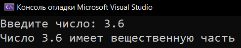
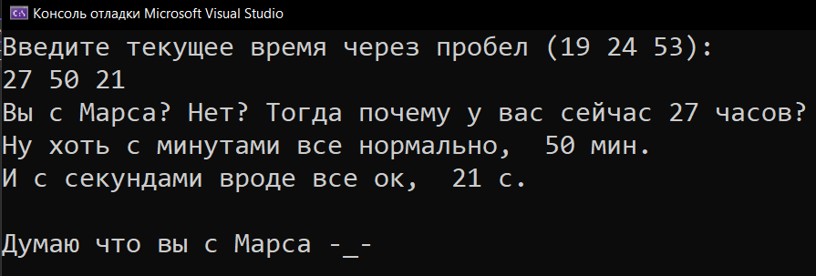
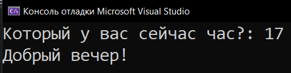
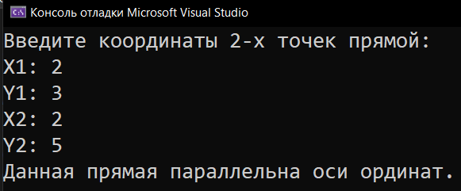
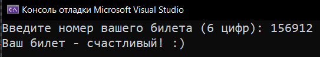

# Homework_8_Conditions
Д/з: Conditions

<a href="https://gist.github.com/SlavikArt/1fbac20972c46ffc1dc9804bd53f596a">Gist - страница со всеми кодами проектов</a>

* [Check_For_A_Float_Part](Check_For_A_Float_Part)
* [Check_The_Time](Check_The_Time)
* [Greeting_By_Time](Greeting_By_Time)
* [Is_The_Line_Parallel](Is_The_Line_Parallel)
* [Lucky_Ticket](Lucky_Ticket)

    <h2>Check for a float part</h2>
    
Есть ли вещественная часть у числа.

    
    <h2>Check the time</h2>
    
Корректно ли введено время?

    
    <h2>Greeting by time</h2>
    
Приветствие в зависимости от времени суток.

    
    <h2>Is the line parallel</h2>
    
Паралельна ли линия оси ординат или абцис.

    
    <h2>Lucky ticket</h2>
    
Ваш билетик счастливый?

    

